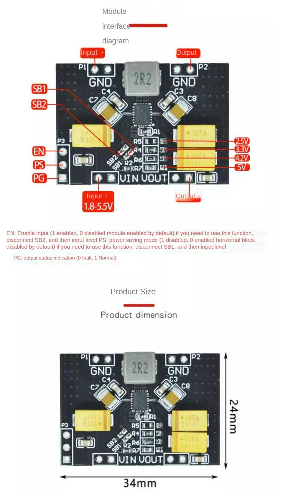

# Hardware
  * ESP32-Mikrokontroller mit WaveShare DriverHat: https://www.aliexpress.com/item/1005001881216085.html
  * Displays: https://www.aliexpress.com/item/1005005121813674.html
  * TPS63020 Boost Converter: https://www.aliexpress.com/item/1005006167904909.html

## Masse
Display: 
  * Aussen: 111mm x 170mm
  * Rand link, oben, rechts: 4mm, unten 10mm
  * Ribbon unten: 73mm, 22mm 75mm, kann auf 1mm umgebogen werden. Ribbon-Länge 24mm, Kontakt 4mm

# Schemas
## TPS63020

## Solar?
https://www.instructables.com/The-Reverse-Joule-Thief-Battery-Charger/

